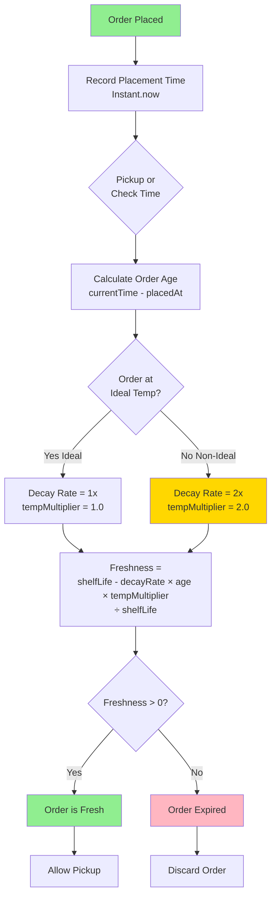
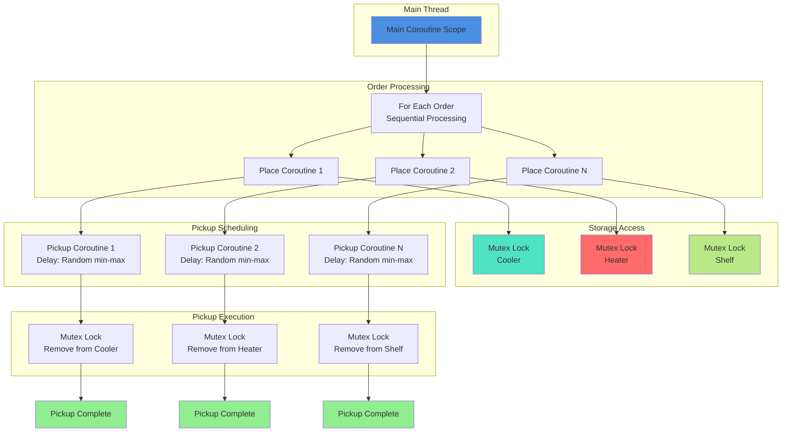
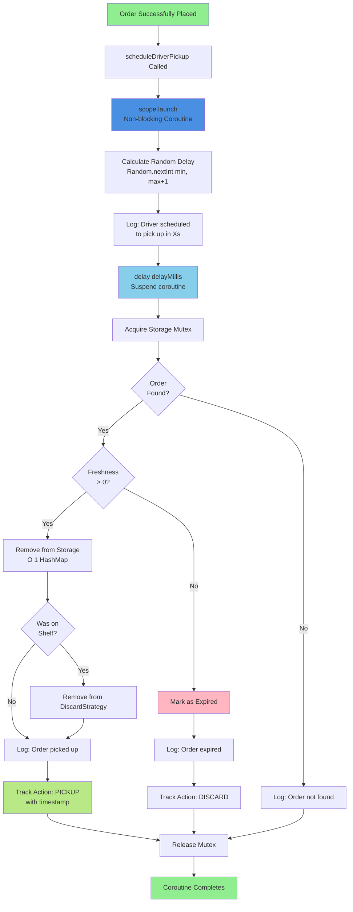
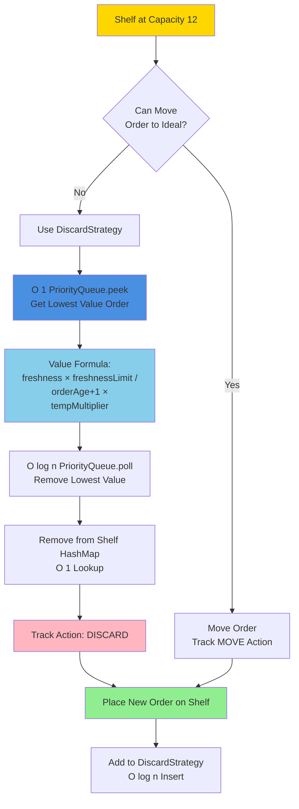

# Cloud Kitchens Application Architecture

## System Flow Diagram

```mermaid
flowchart TD
    Start([Application Start]) --> CLI[Main.kt - CLI Entry Point]
    CLI --> ParseArgs[Parse CLI Arguments<br/>--auth, --rate, --min, --max]
    ParseArgs --> FetchOrders[Client.newProblem<br/>Fetch Orders from Server]
    
    FetchOrders --> InitKitchen[Initialize KitchenManager<br/>Cooler, Heater, Shelf]
    
    InitKitchen --> ProcessLoop{For Each Order}
    
    ProcessLoop --> PlaceOrder[KitchenManager.placeOrder]
    
    PlaceOrder --> CheckTemp{Check Order<br/>Temperature}
    
    CheckTemp -->|Hot| TryHeater{Heater<br/>Has Space?}
    CheckTemp -->|Cold| TryCooler{Cooler<br/>Has Space?}
    CheckTemp -->|Room| TryShelf{Shelf<br/>Has Space?}
    
    TryHeater -->|Yes| AddHeater[Add to Heater<br/>Mutex.withLock]
    TryHeater -->|No| TryShelfHot{Shelf<br/>Has Space?}
    
    TryCooler -->|Yes| AddCooler[Add to Cooler<br/>Mutex.withLock]
    TryCooler -->|No| TryShelfCold{Shelf<br/>Has Space?}
    
    TryShelf -->|Yes| AddShelf[Add to Shelf<br/>Mutex.withLock]
    TryShelf -->|No| ShelfOverflow[Shelf Overflow Logic]
    
    TryShelfHot -->|Yes| AddShelf
    TryShelfHot -->|No| ShelfOverflow
    
    TryShelfCold -->|Yes| AddShelf
    TryShelfCold -->|No| ShelfOverflow
    
    ShelfOverflow --> TryMove{Can Move Shelf<br/>Order to Ideal<br/>Storage?}
    
    TryMove -->|Yes| MoveOrder[Move Order & Place New]
    TryMove -->|No| DiscardLowest[Discard Lowest Value Order<br/>Sub-linear Algorithm]
    
    AddHeater --> TrackPlace[Track Action: PLACE]
    AddCooler --> TrackPlace
    AddShelf --> TrackPlace
    MoveOrder --> TrackPlace
    DiscardLowest --> TrackDiscard[Track Action: DISCARD]
    
    TrackPlace --> SchedulePickup[scheduleDriverPickup<br/>Launch Coroutine]
    TrackDiscard --> NextOrder
    
    SchedulePickup --> CalcDelay[Random Delay<br/>Random.nextInt min-max seconds]
    
    CalcDelay --> WaitPickup[Coroutine delay<br/>Non-blocking wait]
    
    WaitPickup --> PickupOrder[KitchenManager.pickupOrder<br/>Mutex-protected]
    
    PickupOrder --> CheckFresh{Order Still<br/>Fresh?}
    
    CheckFresh -->|Yes| RemoveOrder[Remove from Storage<br/>O(1) HashMap Lookup]
    CheckFresh -->|No| DiscardExpired[Discard Expired Order]
    
    RemoveOrder --> TrackPickup[Track Action: PICKUP]
    DiscardExpired --> TrackDiscardExpired[Track Action: DISCARD]
    
    TrackPlace --> NextOrder{More<br/>Orders?}
    TrackPickup --> ConcurrentWait[Concurrent Pickups<br/>Running in Background]
    TrackDiscardExpired --> ConcurrentWait
    
    NextOrder -->|Yes| ProcessLoop
    NextOrder -->|No| WaitAll[Wait for All Pickups<br/>Join Coroutines]
    
    ConcurrentWait --> WaitAll
    
    WaitAll --> SubmitActions[Client.solve<br/>Submit Action Ledger]
    
    SubmitActions --> ValidationResult{Server<br/>Validation}
    
    ValidationResult -->|Pass| Success([Success - Exit])
    ValidationResult -->|Fail| Failure([Failure - Exit])

    style Start fill:#90EE90
    style Success fill:#90EE90
    style Failure fill:#FFB6C1
    style ShelfOverflow fill:#FFD700
    style DiscardLowest fill:#FF6B6B
    style CheckFresh fill:#87CEEB
    style ValidationResult fill:#DDA0DD
```

## Component Interaction Diagram

```mermaid
flowchart LR
    subgraph Client["API Client"]
        HTTP[Ktor HTTP Client]
        Client[Client.kt]
    end
    
    subgraph Models["Data Models"]
        Order[Order]
        StoredOrder[StoredOrder<br/>with Freshness]
        Action[Action]
        Problem[Problem]
    end
    
    subgraph Manager["Kitchen Manager"]
        KM[KitchenManager]
        DS[DiscardStrategy<br/>PriorityQueue]
        ActionList[Actions List]
    end
    
    subgraph Storage["Thread-Safe Storage"]
        Cooler[Cooler<br/>6 Cold<br/>Mutex]
        Heater[Heater<br/>6 Hot<br/>Mutex]
        Shelf[Shelf<br/>12 Room<br/>Mutex]
    end
    
    Main[Main.kt<br/>CLI] --> Client
    Client --> Problem
    Problem --> Order
    
    Main --> KM
    KM --> StoredOrder
    StoredOrder --> Order
    
    KM --> Cooler
    KM --> Heater
    KM --> Shelf
    KM --> DS
    
    DS --> Shelf
    
    KM --> ActionList
    ActionList --> Action
    
    ActionList --> Client
    Client --> HTTP

    style Main fill:#4A90E2
    style KM fill:#F5A623
    style Cooler fill:#50E3C2
    style Heater fill:#FF6B6B
    style Shelf fill:#B8E986
```

## Freshness Calculation Flow



## Concurrency Model



## Driver Pickup Simulation Flow



## Sub-Linear Discard Algorithm



## Thread Safety & Synchronization
    end
    
    subgraph Synchronization
        MutexC2 --> Wait[WaitAll<br/>All Pickups Complete]
        MutexH2 --> Wait
        MutexS2 --> Wait
    end
    
    Wait --> Submit[Submit Actions]

    style MutexC1 fill:#FF6B6B
    style MutexH1 fill:#FF6B6B
    style MutexS1 fill:#FF6B6B
    style MutexC2 fill:#FF6B6B
    style MutexH2 fill:#FF6B6B
    style MutexS2 fill:#FF6B6B
    style Wait fill:#90EE90
```

## Key Design Decisions

### Thread Safety
- All storage containers use **Mutex.withLock** for atomic operations
- Suspend functions enable concurrent access without blocking threads
- HashMap provides O(1) order lookup by ID
- Coroutines for non-blocking concurrent pickup simulation

### Freshness Tracking
- Real-time calculation using `kotlinx-datetime.Instant`
- Temperature multiplier: 1.0x at ideal temp, 2.0x at non-ideal
- Formula: `(shelfLife - decayRate × orderAge × tempMultiplier) / shelfLife`

### Placement Strategy
1. Try ideal temperature storage first
2. Fallback to shelf if ideal is full
3. If shelf full: attempt to move shelf order to now-available ideal storage
4. If no moves possible: discard order with lowest value using sub-linear algorithm

### Discard Algorithm ✅
- **PriorityQueue** (min-heap) sorted by order value
- **O(log n)** insertion, **O(1)** minimum value peek
- **O(log n)** removal of lowest value order
- Value = `(freshness × freshnessLimit) / ((orderAge + 1) × tempMultiplier)`
- Maintains lowest-value order automatically for shelf overflow

### Driver Pickup Simulation ✅
- **Random delay** between min and max seconds using `Random.nextInt()`
- **Coroutine-based**: Each pickup runs in independent coroutine
- **Non-blocking**: Uses `delay()` instead of `Thread.sleep()`
- **Concurrent execution**: Multiple pickups can happen simultaneously
- **Thread-safe**: Uses existing Mutex-protected `pickupOrder()` method
- **Action tracking**: Automatically logs PICKUP or DISCARD actions
