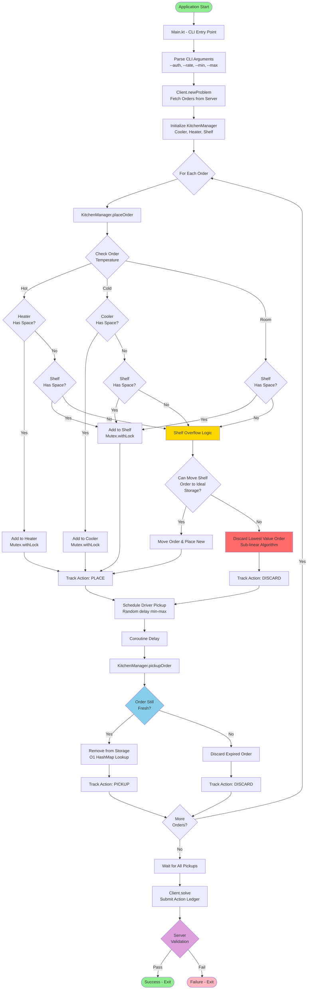
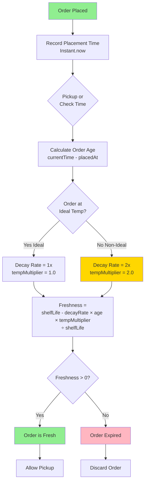
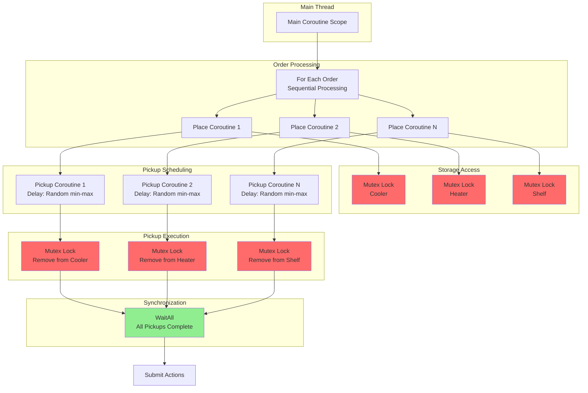

# Cloud Kitchens Application Architecture

## System Flow Diagram



## Component Interaction Diagram

```mermaid
flowchart LR
    subgraph Client["API Client"]
        HTTP[Ktor HTTP Client]
        Client[Client.kt]
    end
    
    subgraph Models["Data Models"]
        Order[Order]
        StoredOrder[StoredOrder<br/>with Freshness]
        Action[Action]
        Problem[Problem]
    end
    
    subgraph Manager["Kitchen Manager"]
        KM[KitchenManager]
        ActionList[Actions List]
    end
    
    subgraph Storage["Thread-Safe Storage"]
        Cooler[Cooler<br/>6 Cold<br/>Mutex]
        Heater[Heater<br/>6 Hot<br/>Mutex]
        Shelf[Shelf<br/>12 Room<br/>Mutex]
    end
    
    Main[Main.kt<br/>CLI] --> Client
    Client --> Problem
    Problem --> Order
    
    Main --> KM
    KM --> StoredOrder
    StoredOrder --> Order
    
    KM --> Cooler
    KM --> Heater
    KM --> Shelf
    
    KM --> ActionList
    ActionList --> Action
    
    ActionList --> Client
    Client --> HTTP

    style Main fill:#4A90E2
    style KM fill:#F5A623
    style Cooler fill:#50E3C2
    style Heater fill:#FF6B6B
    style Shelf fill:#B8E986
```

## Freshness Calculation Flow



## Concurrency Model



## Key Design Decisions

### Thread Safety
- All storage containers use **Mutex.withLock** for atomic operations
- Suspend functions enable concurrent access without blocking threads
- HashMap provides O(1) order lookup by ID

### Freshness Tracking
- Real-time calculation using `kotlinx-datetime.Instant`
- Temperature multiplier: 1.0x at ideal temp, 2.0x at non-ideal
- Formula: `(shelfLife - decayRate × orderAge × tempMultiplier) / shelfLife`

### Placement Strategy
1. Try ideal temperature storage first
2. Fallback to shelf if ideal is full
3. If shelf full: attempt to move shelf order to now-available ideal storage
4. If no moves possible: discard order with lowest value using sub-linear algorithm

### Discard Algorithm (Planned)
- Priority queue (heap) sorted by order value
- O(log n) insertion, O(1) minimum retrieval
- Value = `(freshness × shelfLife × decayModifier) / (orderAge × tempMultiplier)`
